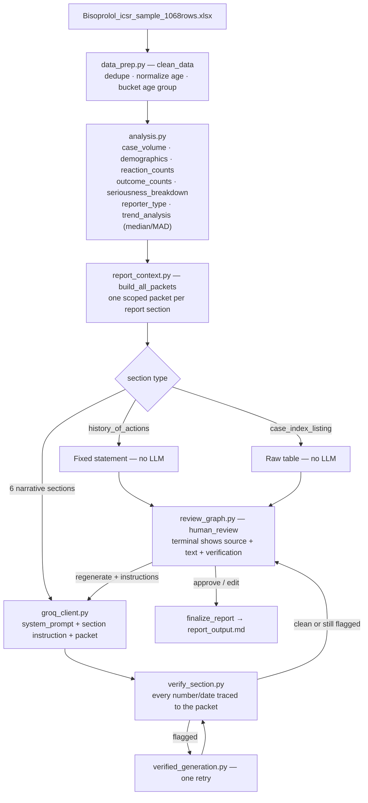
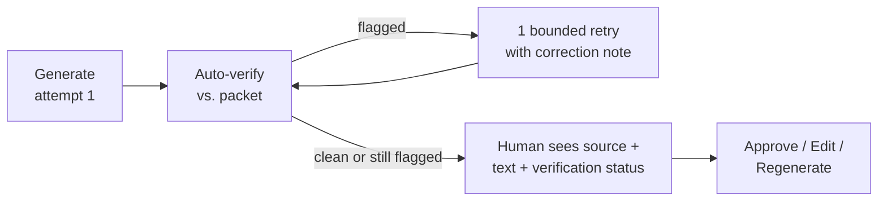

<div align="center">

# Bisoprolol PADER Generator

### submission by Nihar Nandala


</div>

---

- Pharma companies get flooded with adverse event reports, someone took a drug, something
  happened, it got logged.
- Every so often all of that has to turn into one clean safety report for regulators. That's
  what I built here.
- The one rule I kept coming back to the whole time: the report can only say what the data
  actually backs up, never what the model just felt like saying.
- So the whole design is, count everything for real in plain Python first, let the model turn
  those already-correct numbers into readable sentences, then check its own sentences against
  the numbers before a human even sees it.

## What actually makes this different

Most people doing this challenge already know not to just dump the raw CSV into a prompt and
ask for a report, the challenge doc says explicitly not to do that. The failure mode I'd
actually bet on is the opposite one: grabbing a full agentic framework, multiple agents,
tool-calling loops, memory, the works, for a job that's genuinely this simple. That's like
showing up to hang one picture frame with a full toolbox, a power drill, and a laser level.
None of that makes the job better, it just gives you more stuff that can break, and when it
does, you're debugging a laser level instead of just hammering a nail. Here's what I actually
did instead, keep it as simple as the problem actually is, but make what's there genuinely
solid:

- **I don't trust a statistical method just because it's the textbook one.** The trend-detection
  method (mean ± 2 std) is what everyone reaches for first. I built a tiny adversarial test case
  on purpose (`10, 12, 11, 13, 50`) specifically to try to break it, and it broke, mean/std
  missed the obvious outlier because the outlier drags its own mean and std up while you're
  calculating them. Switched to median + MAD, re-ran the same test, it caught it.
- **I don't trust my own assumptions until I've tested them against the real data.** Almost
  paired the reaction list and outcome list by position, since both columns are comma separated
  the same way, felt obviously right. Checked list lengths per row before shipping that
  assumption, 6 out of 1,068 rows don't actually line up. So outcome counts are reported
  independently instead, not falsely tied to a specific reaction they might not belong to.
- **The verification retry is phrased as a question, on purpose, not a statement.** If my
  checker throws a false positive and I tell the model flatly "this number is wrong," it'll
  delete a number that was actually correct just to make the complaint go away. So the retry
  prompt says "double check this, fix it if it's genuinely wrong, keep it if it's actually
  right."
- **I show my own uncertainty to the reviewer instead of hiding it.** If a section gets flagged,
  retried, and comes back clean, I still tell the human reviewer it was flagged once, because
  clean could mean fixed, or it could mean the model just deleted the flagged part. Only a
  human looking at the real data can tell those apart.
- **The known-limitations section is real, not a formality.** Every limitation further down is
  something I actually found by trying to break my own method, not a guess.

## Contents

- [1. How do I run it](#1-how-do-i-run-it)
- [2. Architecture](#2-architecture)
- [3. Where AI is used vs. deterministic code, and why](#3-where-ai-is-used-vs-deterministic-code-and-why)
- [4. The actual prompts](#4-the-actual-prompts)
- [5. How the system stays grounded](#5-how-the-system-stays-grounded)
- [6. How I'd evaluate this at scale](#6-how-id-evaluate-this-at-scale-1000-reports-not-one)
- [7. Why LangGraph, and nothing fancier](#7-why-langgraph-and-nothing-fancier)
- [8. Generalizing beyond PADER](#8-generalizing-beyond-pader)
- [9. Known limitations, and the honest parts](#9-known-limitations-and-the-honest-parts)
- [Repo layout](#repo-layout)
- [Submission + rubric checklist](#submission--rubric-checklist)

---

## A real worked example, packet → prompt → output

The challenge doc shows a "raw data → analysis → packet → output" chain as the actual thing
being graded here, so instead of dataset charts that just repeat `report_output.md`, here's
that exact chain, for real, from this system, for the `serious_cases_15day` section:

**1. What Python computed** (`analysis.py` + `report_context.py`, deterministic, zero AI):
```json
{
  "alert_cases": 1023,
  "non_alert_cases": 1,
  "alert_pct": 99.9,
  "alert_reactions": {"Acute kidney injury": 80, "Drug ineffective": 53, "Hypotension": 46},
  "alert_outcomes": {"recovered/resolved": 494, "unknown": 328, "recovering/resolving": 226}
}
```

**2. What got sent to the model**: this exact JSON glued to `prompts/serious_cases_15day.py`'s
instruction (packet fields declared + focus + shape example, same pattern shown in §4).

**3. What the model actually wrote back**, this run, verbatim, no edits:
> "There were 1023 alert cases, which accounted for 99.9% of the total cases. The most common
> reactions among these alert cases were Acute kidney injury with 80 occurrences, Drug
> ineffective with 53 occurrences, and Hypotension with 46 occurrences. The most common outcomes
> among the alert cases were recovered/resolved with 494 occurrences, unknown with 328
> occurrences, and recovering/resolving with 226 occurrences. Expectedness (labelled/unlabelled
> status) could not be assessed, as no product label was supplied for this exercise."

**4. What `verify_section.py` checked**: every number in that paragraph, `1023`, `99.9`, `80`,
`53`, `46`, `494`, `328`, `226`, pulled out and checked against step 1's JSON. Every single one
is there, unchanged. That's what "grounded" actually looks like on a real run, not a claim.

---

## 1. How do I run it?

```bash
python -m venv genar-env
genar-env\Scripts\activate        # Windows
# source genar-env/bin/activate   # macOS/Linux

pip install -r requirements.txt
```

Put your own Groq key in `.env` at the project root:
```
GROQ_API_KEY=your_key_here
```

Drop `Bisoprolol_icsr_sample_1068rows.xlsx` into `data/`. Not shipped in this zip, wasn't
supposed to be. One command, run from the project root:
```bash
python src/run_review.py
```

What actually happens:
- Loads the excel file, cleans it, runs every analysis
- Builds a focused packet of facts per section
- Generates and checks each section
- Pauses in the terminal per section, source data + generated text + whether it needed fixing
- I `approve (a)` / `edit (e)` / `regenerate (r)` each one
- Once everything's approved, `report_output.md` gets written and the run's done

---

## 2. Architecture



- One straight line, left to right, one loop back for retries
- The model shows up in exactly one box out of eight
- Everything to its left is plain pandas, everything to its right is plain code double-checking
  the model's own output, boxed in on both sides on purpose
- Could've just handed the whole spreadsheet to the model and said "write me a report," didn't
  want that, no way afterward to tell which sentence is real and which one the model made up
- Splitting counting (Python) from writing (LLM) means every number in the final report traces
  back to one exact line of code that computed it

---

## 3. Where AI is used vs. deterministic code, and why

| 🐍 Plain Python — every number | 🤖 Groq (`llama-3.3-70b`) — phrasing only |
|---|---|
| Total/serious/alert counts | Turns already-correct facts into 2-5 sentences of plain English |
| Age / sex / country breakdowns | Decides what's worth leading with, in what order |
| Reaction & outcome counting | Never computes, estimates, or rounds a number itself |
| Trend spike detection (median + MAD) | Told to state facts, never *why* something happened |
| Checking its own writing against the source | 2 of 8 sections never call it at all |

The question I asked myself for every required analysis:
- Does the model need to compute this, or does python already know the exact answer?
- Python always knows, so none of the counting ever went to the model
- Model's job stayed narrow on purpose: turn already-correct facts into readable prose, that's
  a real judgment call, counting rows isn't

Trend detection's the one place that took real thought, "is this week unusual" isn't a one-line
count, it's a judgment call about what "normal" even means for this data:

- **First pass**: mean ± 2 standard deviations, the textbook move.
- **The problem I found with it**: a genuine spike inflates its own mean and its own standard
  deviation while you're calculating them, since the spike is part of the data being averaged,
  so it can end up hiding itself.
- **Tested that on purpose**: made up a tiny example, `10, 12, 11, 13, 50`, one obvious outlier.
  Ran mean/std on it and it missed the outlier completely, the band was wide enough to swallow
  it.
- **Switched to median + MAD instead**: median's just the middle value, can't get dragged around
  by one extreme number. MAD ("median absolute deviation") means "how far, typically, does a
  value sit from the median," measured the same outlier-resistant way.
- **Re-ran the same test**: this time it caught the outlier correctly.

Zero AI in any of that, just the right statistical tool, and I only trusted it because I tried
to break it first.

One more model-behavior decision worth calling out, since it's easy to skip past: `groq_client.py`
calls the model with `temperature=0.15` and `max_tokens=500`, not the defaults.
- Low temperature on purpose: this task needs consistency and restraint, not creative variety,
  a high temperature actively works against "don't embellish," it's the wrong setting for a
  regulatory document, no matter how good the prompt is
- Capped `max_tokens` on purpose too: it structurally forces the "2-5 sentences, no filler" rule
  from the system prompt instead of just asking nicely and hoping, if the model wants to ramble,
  it physically can't
- Neither of these is a prompt-wording choice, they're a real understanding that how you call
  the model matters as much as what you tell it

---

## 4. The actual prompts

- One shared system prompt, the rules that apply no matter which section is being written
- Plus one small file per section, what that section covers and what facts it's allowed to see
- Kept these separate on purpose, a new section later is "write one small file," not "edit a
  giant prompt and hope I don't break the other seven"

**System prompt** (`prompts/system_prompt.py`), sent as the system message every call, full text:

```
## ROLE
You are drafting one section of a PADER (Periodic Adverse Drug Experience Report)
for a pharmaceutical safety team. Your only source of truth is the data inside
the <packet> tags below. You have no other knowledge of this product or these
cases beyond what is given there.

## CONSTRAINTS

1. TWO LEVELS ONLY:
   - OBSERVED: raw countable facts from the packet.
   - DERIVED: comparisons/patterns built ONLY from those facts.
   NEVER a third level, INTERPRETATION (what a pattern MEANS or WHY it happened).

2. EVERY number you write must appear unchanged inside <packet>. Do not
   calculate, estimate, or round anything not already computed for you.

3. If a field has no data, say so explicitly. NEVER fill a gap with a guess.

4. NEVER mention: System Organ Class, comorbidities, concomitant medications,
   product label/expectedness, or causality — UNLESS that exact data appears
   inside <packet>.

5. Tone: formal regulatory register, third person, past tense. No filler
   phrases ("it is important to note"), no marketing language.

6. Output plain prose, 2-5 sentences, no headers, no bullets, no restating
   the section title.

## EXAMPLES

<good>
"Reports of Drug ineffective increased from 12 cases in January to 31 cases
in March. This was the second most frequently reported reaction overall."
</good>
<bad>
"The sharp rise in Drug ineffective reports likely reflects a genuine
treatment failure pattern that warrants urgent clinical review."
</bad>
(bad = interpretation, asserts cause and urgency not present in the data)

<good>
"No cases in this dataset were flagged with life-threatening seriousness."
</good>
<bad>
"Zero life-threatening cases suggests Bisoprolol has a favorable safety
profile in this population."
</bad>
(bad = draws a safety conclusion from a single count, not supported)

<good>
"No history of safety-related actions was provided for this reporting period."
</good>
<bad>
"No actions were likely necessary given the absence of major safety concerns."
</bad>
(bad = invents a reason for the absence of data instead of just stating it)

## OUTPUT
Return only the section's prose. Nothing else, no preamble, no closing remark.
```

- Rule 1, OBSERVED / DERIVED / never INTERPRETATION, is basically me enforcing "only say what
  the data supports" directly in the prompt
- Just telling the model "don't interpret" doesn't work, interpretation is what sounds most
  natural in fluent writing, so it slips in anyway
- Showing it a concrete good/bad pair right next to the rule is what actually made it stick

**One section example** (`prompts/narrative_summary.py`, full text):

```
## TASK
Write the Narrative Summary and Analysis section.

## PACKET FIELDS
<packet>
case_volume: total/serious/alert counts and percentages
top_age_group, top_sex, top_country: most represented category in each
top_reaction, top_serious_reaction: most common reaction overall / among serious cases
top_outcome: most common outcome overall
trend_hikes: any week/month flagged as an unusual spike (may be empty)
</packet>

## FOCUS
Cover, in this order: total case volume + serious/alert split, the most
represented age group/sex/country, the most common reaction overall AND
among serious cases specifically, the most common outcome, then any
trend_hikes finding stated with its exact period and count. If trend_hikes
is empty, state that no unusual spike was identified.

## EXAMPLE SHAPE (not real numbers, just the pattern to follow)
"During the reporting period, [N] cases were received, of which [N] ([%])
were serious and [N] ([%]) met 15-day alert criteria. ..."
```

- The other five section files (`summary_analysis_of_cases.py`, `reaction_ae_analysis.py`,
  `serious_cases_15day.py`, `trends_observations.py`, `reporting_period.py`) follow this same
  shape
- `groq_client.py` just looks up the right file by name and glues it to that section's real
  packet, nothing hardcoded per section
- Each section only gets the fields its own file lists, `reaction_ae_analysis` never sees
  demographics or outcomes
- Didn't want to dump everything into every call "just in case," more irrelevant context
  doesn't just cost tokens, it gives the model more chances to pull the wrong number into the
  wrong sentence

---

## 5. How the system stays grounded



Grounded means one specific thing to me here: can every number and date the model wrote be
found, unchanged, in the exact packet it was given?

- `verify_section.py` checks this with plain regex, not another model call
- Pulls numbers/dates out of the text, pulls them out of the packet too (digging through nested
  dicts and labels like `"18-64"`, since the model naturally quotes those verbatim)
- Flags anything in the text that's missing from the packet

If something's flagged, it gets exactly one retry, not an unlimited loop. The wording mattered
more than I expected going in:

- The model's told "double check this, fix it if it's genuinely wrong, keep it if it's actually
  right," phrased as a question, not "this is wrong"
- If my checker throws a false positive and I tell the model flatly "this is wrong," it'll
  obediently delete a number that was actually fine just to make the complaint go away, that's
  worse than the original flag, now something true is missing and it looks clean
- After that one retry, it goes to me either way, still flagged (shown exactly what) or clean
  (with a note that clean doesn't guarantee it actually got fixed, could just mean the flagged
  part got deleted instead)
- I show that ambiguity on purpose, not a green checkmark, only a human looking at the real
  data can tell the difference

<details>
<summary>🐛 The regenerate-path bug I actually found by testing it</summary>

<br>

One thing I only caught by actually running the regenerate path, not by reasoning about it in
my head:

- `apply_regenerations()` (the code that handles a manual regenerate request) used to build its
  result in a slightly different shape than the normal generation path, missing one key the
  display logic checks for
- Result: a regenerated section's verification status silently never showed up on the next
  review pass, even if the regenerate itself introduced a new problem
- Fixed by making both paths build results the exact same shape
- Small bug, but it's a good example of why "I tested the happy path" isn't the same as "I
  tested it," this was the one part of the review loop nobody had actually exercised until I
  forced myself to

</details>

Human review is the real final gate here:

- Every section shows the source packet and generated text side by side, plus the verification
  status
- Something concrete to check against, not a paragraph I have to just trust because it sounds
  plausible
- Nothing hits `report_output.md` until I've approved it

---

## 6. How I'd evaluate this at scale (1,000 reports, not one)

| Tier | What | Why |
|---|---|---|
| **1 — automated, free** | Log the flagged/clean result per section per run, watch the flagged-rate trend. Add cheap sanity checks (serious ≤ total, sub-counts sum to parent) that fail loudly. | Already running anyway, turns "seems fine" into an actual number I can track |
| **2 — sampled human audit** | Random sample, not just the flagged ones. Track approve vs. edit vs. regenerate rate over time. | Flagged-only sampling misses the scarier case, wrong but not caught by the checker. A rising edit rate is an early warning |
| **3 — fixed test set** | Small set of hand-verified report/packet pairs, re-run every time the prompt/model/analysis changes. | Same idea as a unit test, just for correctness of writing, not code. This is the actual biggest gap right now |

- Not just theory either, `all_reaction_counts` and `serious_reaction_counts` differ by exactly
  1 on "Drug ineffective," matching the single known non-serious case in the whole dataset
  exactly
- That's not luck, that's a self-consistency check that already proved my own counting logic
  was right before report generation even existed

---

## 7. Why LangGraph, and nothing fancier

The challenge doc says more agents, more frameworks, or RAG where a lookup would do, doesn't
score points. So here's what I genuinely didn't build, and why:

- **No multiple agents.** One model call, one job, write this section from these facts.
  Splitting that into "planner agent, writer agent, critic agent" adds coordination cost for a
  problem I don't actually have.
- **No RAG.** RAG earns its keep searching a big pile of unstructured documents for the relevant
  few facts. Not this problem, every fact the model needs is already known exactly and handed
  over directly, every time. Nothing to search for.
- **So why LangGraph at all?** One specific thing I actually needed: pause mid-run, wait for me
  to make a decision, however long that takes, then resume exactly where it stopped.
  `interrupt()` does exactly that, the checkpointer remembers exactly where execution stopped,
  so `graph.invoke(Command(resume=...))` picks back up right there instead of starting over.
  Building that myself means writing state to a file/db and figuring out how to re-enter the
  process at the right spot, real infrastructure work that has nothing to do with the actual
  problem. That's the real reason it's here, not because it looks impressive on a resume.

---

## 8. Generalizing beyond PADER

The real question the challenge doc is actually asking: if a request came in tomorrow for PSUR,
PBRER, DSUR, CSR, each with different sections and analyses, how much of this survives
untouched, as config/data instead of new code?

**This is also my actual Version 1**, not just a design doc, real implementation, tested end to
end. Full writeup with a before/after diagram is in [`version1/README.md`](./version1/README.md),
short version below.

| ✅ Survives unmodified | 🔧 Still needs real, contained work |
|---|---|
| `analysis.py` — df in, facts out, has no idea what report type asked | `review_graph.py`'s LangGraph nodes still assume one report's sections running at a time |
| `config.py` column mapping — point it at a new schema, done | |
| `SECTION_INSTRUCTIONS` dict — new section = new file, zero calling code touched | |
| `verify_section.py` — fully generic, zero PADER logic in it | |
| `build_all_packets()` — no longer hardcodes anything | |

- Used to be, "what does section X need" only lived inside which function called which,
  buried in `build_all_packets()`
- Now it's a `SECTION_REGISTRY` dict, each section declares `"needs": [...]` as plain data
- New report type with a different mix of sections = new registry entry, not new code
- See `version1/README.md` for the full before/after + the regenerate-path bug this refactor caught

---

## 9. Known limitations, and the honest parts

Every one of these is something I actually found by trying to break my own method, not
something I'm guessing might be a problem.

| Limitation | Why it's left this way |
|---|---|
| **Country field mixes full names and raw codes** (`"france"` next to `"SA"`) | Actually checked this, didn't just leave it out of caution. Compared the full names and codes present in this specific dataset under standard ISO-3166 notation, none of them collide. So there's no real ambiguity here to resolve, normalizing would've been cosmetic, not a fix. Worth re-checking on a future dataset though, verified on this file's actual values, not guaranteed to hold on a different one |
| **Median/MAD assumes a roughly symmetric spread** | The scaling constant (1.4826) is derived assuming something close to a normal curve. A skewed future dataset would over-flag one side, under-flag the other. This dataset's shape checked out fine |
| **Catches a single unusual point, not a sustained baseline shift** | A genuine step up to a new, consistently higher volume for months wouldn't get flagged, different problem (change-point detection) than the one this answers. Confirmed the real data doesn't do this |
| **No SOC or label/expectedness data** | Neither was supplied, both explicitly out of scope, prompt's told never to mention either unless it's literally in a packet |
| **One bounded retry only** | Caps an endless loop chasing a possible false positive. Still-flagged sections go to me clearly marked, not retried forever |
| **In-memory checkpointing only** | A crash mid-review (happened to me live, from a Groq rate limit) restarts the whole pipeline, re-generating sections that already succeeded, burning tokens on finished work |
| **Groq's free-tier daily cap is real** | 6 of 8 sections call the model, flagged ones cost a retry, so one run is already 6-12+ calls before manually regenerating anything. Adds up fast against a daily cap, stacks badly with the point above when it crashes |
| **No fixed hand-verified test set yet** | Only per-run grounding checks exist today, no stable benchmark re-checked across prompt/model changes |

<details>
<summary>🐛 The live crash I actually hit, mid-run</summary>

<br>

- Mid-run, Groq's free-tier rate limit kicked in for real and threw a `RateLimitError` in the
  terminal, this wasn't a hypothetical I wrote into the limitations table after the fact
- Makes sense once you count it: 6 of 8 sections call the model, and a flagged section costs a
  second call for the retry, so one run is already 6-12+ calls before I've regenerated anything
  by hand
- Because checkpointing is in-memory only (see the row above), the crash meant starting the
  whole pipeline over, re-generating sections that had already passed review, not resuming from
  where it stopped
- Didn't fix the underlying rate limit, that's Groq's free tier, not my bug, but it's the reason
  "in-memory checkpointing" made it into the limitations table as a real cost, not a theoretical
  one, and it's why I called out Groq's speed vs. Gemini's in the repo layout notes below, this
  is the tradeoff that speed is actually solving for

</details>

---

## Repo layout

```
├── data/                    dataset, not shipped, provided separately
├── prompts/                 system prompt + one instruction file per section
├── src/
│   ├── data_prep.py          cleaning, age normalization/bucketing
│   ├── analysis.py           every deterministic analysis
│   ├── config.py             column-name constants — the generalization seam
│   ├── report_context.py     assembles the per-section fact packets
│   ├── groq_client.py        the one place the model actually gets called
│   ├── verify_section.py     grounding check — every number/date traced to source
│   ├── verified_generation.py  generate → verify → one bounded retry
│   ├── review_graph.py       the LangGraph state machine + human-review pause
│   ├── run_review.py         entry point, terminal review loop  ← run this one
│   └── data_analysis.ipynb   exploratory analysis, kept as process evidence
├── report_output.md          actual generated report, a completed real run
├── requirements.txt
└── README.md
```

- `app.py` (Streamlit version of the review screen) and `build_report.py` (non-interactive
  version used during dev to sanity-check generation without stepping through review by hand)
  are earlier iteration, still in here, but not the entry point, `run_review.py` is
- `gemini_client.py` is what this was originally built on, moved to Groq for two real reasons:
  latency (waiting on Gemini per section adds up fast across a run that's already 6+ calls,
  Groq's noticeably faster per call) and rate limits (that same call volume burns a free tier's
  budget fast regardless of provider, Gemini's was getting hit sooner in practice)
- Both clients still sit in the repo, but `verified_generation.py` and `review_graph.py` import
  from `groq_client.py`, that's the one actually running

---

## Submission + rubric checklist

What the submission guide says the README has to answer:

| # | Question | Where |
|---|---|---|
| 1 | How do I run it | [§1](#1-how-do-i-run-it) |
| 2 | What's the architecture | [§2](#2-architecture) |
| 3 | AI vs. deterministic, and why | [§3](#3-where-ai-is-used-vs-deterministic-code-and-why) |
| 4 | Actual prompts, shown not described | [§4](#4-the-actual-prompts) |
| 5 | How it stays grounded | [§5](#5-how-the-system-stays-grounded) |
| 6 | Evaluation at 1,000 reports, not one | [§6](#6-how-id-evaluate-this-at-scale-1000-reports-not-one) |
| 7 | Known limitations | [§9](#9-known-limitations) |
| ★ | Generalizing past PADER, the real test | [§8](#8-generalizing-beyond-pader) |

And what the challenge doc's own grading table is actually looking for:

| Graded on | Where |
|---|---|
| AI fundamentals | [§3](#3-where-ai-is-used-vs-deterministic-code-and-why) |
| Context engineering | [§4](#4-the-actual-prompts) |
| Prompt design | [§4](#4-the-actual-prompts) |
| Architecture | [§2](#2-architecture) |
| Agent/tool judgment | [§7](#7-why-langgraph-and-nothing-fancier) |
| Grounding | [§5](#5-how-the-system-stays-grounded) |
| Evaluation | [§6](#6-how-id-evaluate-this-at-scale-1000-reports-not-one) |
| Generalization | [§8](#8-generalizing-beyond-pader) |
| Execution | `report_output.md` in this repo is a real completed run, plus the [worked example](#a-real-worked-example-packet--prompt--output) is verbatim real output, plus §9 documents an actual live crash (Groq rate limit) and what running it again after that looked like, not a one-shot lucky demo |

---

<div align="center">

Built by **Nihar Nandala** for the GenAR AI Engineering Challenge.

</div>
