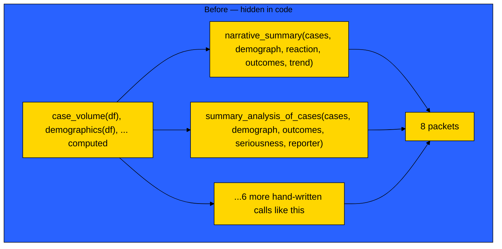
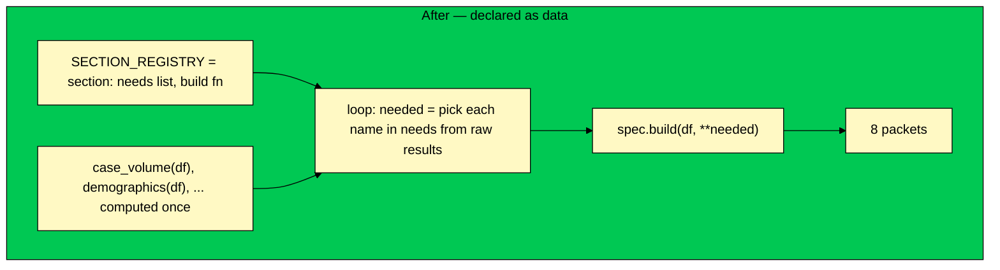

<div align="center">

# Version 1 — section dependencies, declared as data

### GenAR AI Engineering Challenge — generalization writeup


</div>

---

- Picked from the challenge's 7 suggested V1 directions: **section dependencies**
- Why this one: it's the actual real gap I found in my own V0, not one I picked because it
  sounds good

## Contents

- [The problem](#the-problem)
- [Before → after](#before--after)
- [What I built](#what-i-built)
- [Proof it works](#proof-it-works)
- [What's still not fixed](#whats-still-not-fixed)

---

## The problem

- `analysis.py`, `config.py`, `SECTION_INSTRUCTIONS` already didn't care what report type was
  asking, genuinely reusable already
- One place still did: `build_all_packets()`
- It "knew" `narrative_summary` needs `case_volume`, `demographics`, `reaction_counts`,
  `outcome_counts`, `trend_analysis` only because those were the exact variables typed into that
  one function call
- That knowledge lived in code structure, not anywhere you could read it without tracing
  function calls by hand

---

## Before → after





- Before: reading "what does `narrative_summary` need" means opening `report_context.py` and
  reading its function call
- After: reading "what does `narrative_summary` need" means reading one line in
  `SECTION_REGISTRY`

---

## What I built

The actual code, verbatim from `report_context.py`, not a paraphrase:

```python
SECTION_REGISTRY = {
    "narrative_summary": {
        "needs": ["case_volume", "demographics", "reaction_counts", "outcome_counts", "trend_analysis"],
        "build": narrative_summary,
    },
    # ...one entry like this per section
}

def build_all_packets(df):
    all_analysis = {
        "case_volume": case_volume(df),
        "demographics": demographics(df),
        # ...every analysis computed once, up front
    }
    packets = {}
    for section_key, spec in SECTION_REGISTRY.items():
        needed = {name: all_analysis[name] for name in spec["needs"]}
        packets[section_key] = spec["build"](df, **needed)
    return packets
```

- `SECTION_REGISTRY` dict in `report_context.py`, one entry per section
- Each entry declares `"needs": [...]` (plain list of analysis names) + `"build": ...`
  (which function shapes it)
- `build_all_packets()` is now one generic loop instead of 8 hand-written lines
- Packet-builder functions do the exact same shaping logic as before, just pull inputs by name
  from a dict instead of positional args, so `needs` actually matches what's inside the function
- Bonus, same trip: `review_graph.py` used to hardcode `if section_key == "history_of_actions"`
  to decide "skip the LLM", now it checks whether that section even has an instruction, driven
  by data already in `prompts/`

---

## Proof it works

- Ran `python src/run_review.py` after the refactor, all 8 sections, same numbers as before,
  refactor didn't break anything

<details>
<summary>🐛 The bug this refactor actually caught, by testing it, not by reviewing the diff</summary>

<br>

- Tested the regenerate path for the first time ever doing this, and it caught a real bug:
  `apply_regenerations()` built results in a different shape than normal generation, so a
  regenerated section's verification status was silently never shown
- Fixed by making both paths build the same shape
- That's the actual point of testing something instead of assuming it works, a refactor that
  "obviously doesn't change behavior" still needs the untouched paths exercised, not just the
  ones you were thinking about while writing it

</details>

---

## What's still not fixed

- `review_graph.py`'s LangGraph nodes still assume one report's sections running at a time
- A second real report type running through the same graph would need a report-type identifier
  threaded through it, that part's still genuinely new work
- Cheapest thing left on the table if there's more time: versioning, stamp `report_output.md`
  with which model/dataset/prompt produced it

---

<div align="center">

Full main writeup: [`README.md`](../README.md)

</div>